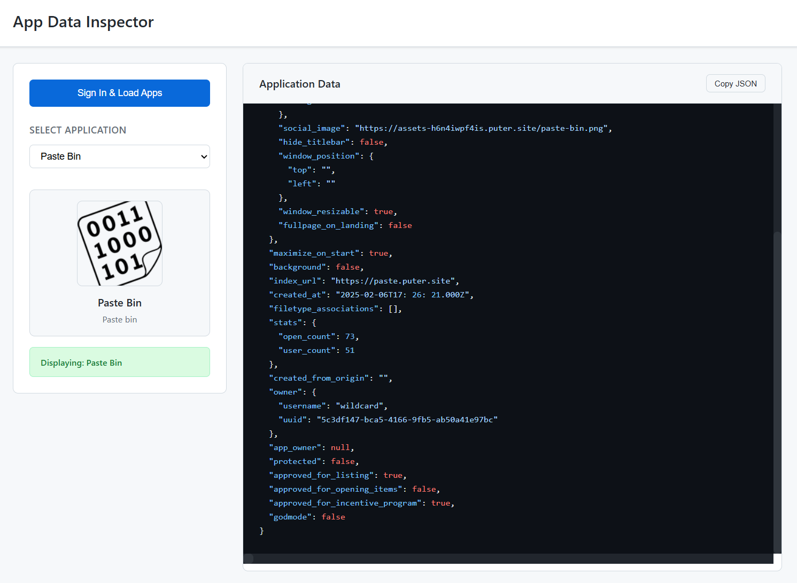

<h1 align="center">
  <a href="https://puter.com/app/app-inspector" target="_blank">App Data Inspector</a>
</h1>

<p align="center">A developer tool for inspecting and exploring the metadata of applications in your Puter account.
</p>

<p align="center">
  
</p>

<br>

## Features

- **User Authentication**: Secure sign-in with Puter account
- **App Listing**: Complete inventory of user's Puter applications
- **Detailed Inspection**: Full JSON structure examination of each app
- **Visual Preview**: App icons and metadata in a clean interface
- **Copy Functionality**: One-click JSON data copying for development use

<br>

## Getting Started

Clone the repository: 

```bash
git clone https://github.com/puter-apps/puter-app-data-inspector.git
```

and open the `index.html` file in any hosted environment.

Alternatively, access the hosted version at [https://puter.com/app/app-inspector](https://puter.com/app/app-inspector)

<br>

## How It Works

App Data Inspector leverages [**Puter.js**](https://developer.puter.com/) to provide developer insights:

1. **Authentication**: Uses Puter's authentication system to securely access user app data

2. **App Discovery**: Retrieves the complete list of applications in the user's account

3. **Data Extraction**: Pulls the full metadata structure for each application

4. **Visual Rendering**: Presents complex JSON data with syntax highlighting and visual organization

<br>

## For Developers

This project includes tutorial-style comments in the JavaScript code that explain how to use Puter.js. These comments are designed to help developers who are new to the Puter platform understand how to integrate with Puter services.

<br>

## License

MIT
