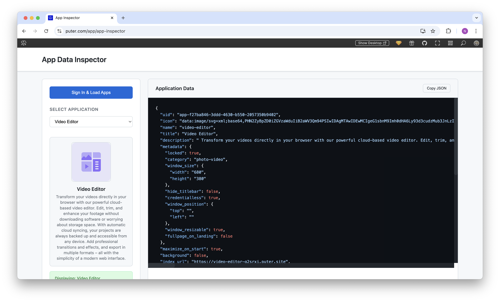

<h1 align="center">
  <a href="https://puter.com/app/app-data-inspector" target="_blank">Puter App Data Inspector</a>
</h1>

  

A developer tool that allows you to inspect and explore the metadata of applications in your Puter account. This tool provides a clean interface to view the complete JSON data structure of your Puter apps.

## Features

- **User Authentication**: Sign in with your Puter account
- **App Listing**: View all applications in your Puter account
- **Detailed Inspection**: Examine the complete JSON structure of each app
- **Visual Preview**: See app icons and basic information in a visual format
- **Copy Functionality**: Easily copy the JSON data for use in other tools or documentation

## How It Works

1. Sign in with your Puter account
2. Your apps are automatically loaded and displayed in a dropdown menu
3. Select an app to view its complete data structure
4. The app's icon, name, and description are displayed in a preview panel
5. The full JSON data is displayed with syntax highlighting
6. Copy the data to your clipboard with a single click

## Technical Details 

This application uses:
- Puter.js SDK for authentication and app data retrieval
- Vanilla JavaScript for the frontend
- Modern CSS for styling with a responsive design
- JSON formatting and syntax highlighting

## Puter SDK Integration

The App Data Inspector serves as a practical example of how to use the Puter SDK:

- Authentication with `puter.auth.signIn()` and `puter.auth.isSignedIn()`
- App data retrieval with `puter.apps.list()`
- Handling and displaying complex JSON data structures

## Getting Started

To run this project locally:

1. Clone the repository
2. Open the `index.html` file in a web browser
3. Sign in with your Puter account
4. Start exploring your app data

Alternatively, access the hosted version at [puter.com/app/app-data-inspector](https://puter.com/app/app-data-inspector)

## For Developers

This project includes tutorial-style comments in the JavaScript code that explain how to use the Puter SDK. These comments are designed to help developers who are new to the Puter platform understand how to integrate with Puter services.

## License

MIT
